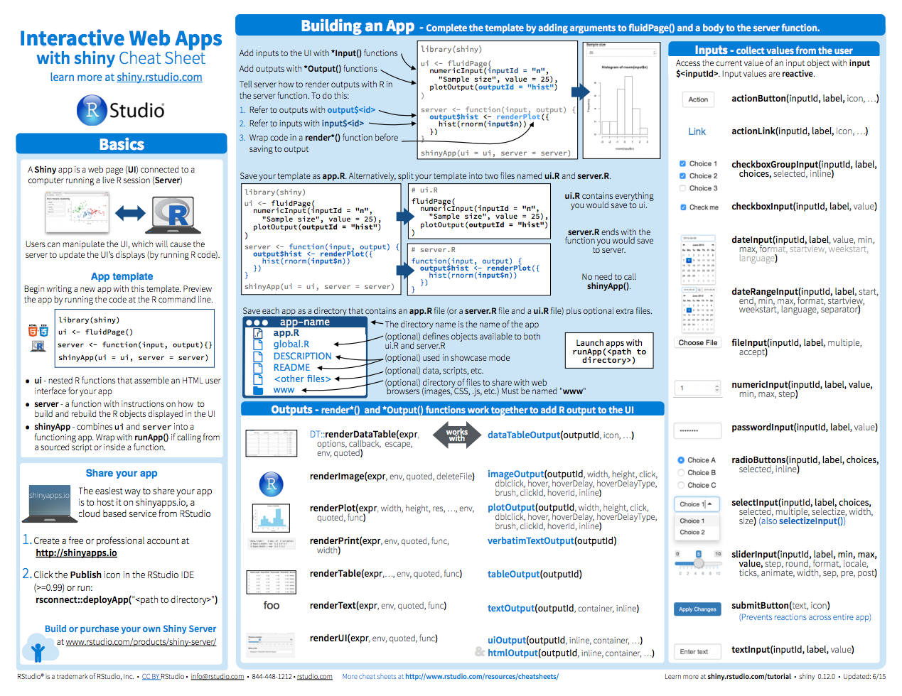
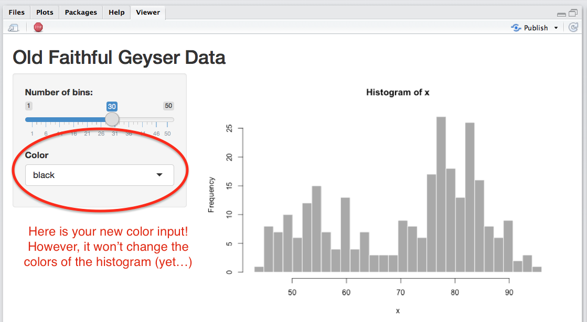
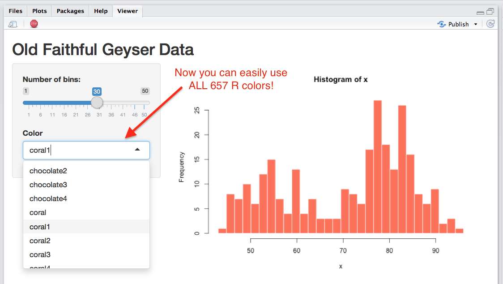
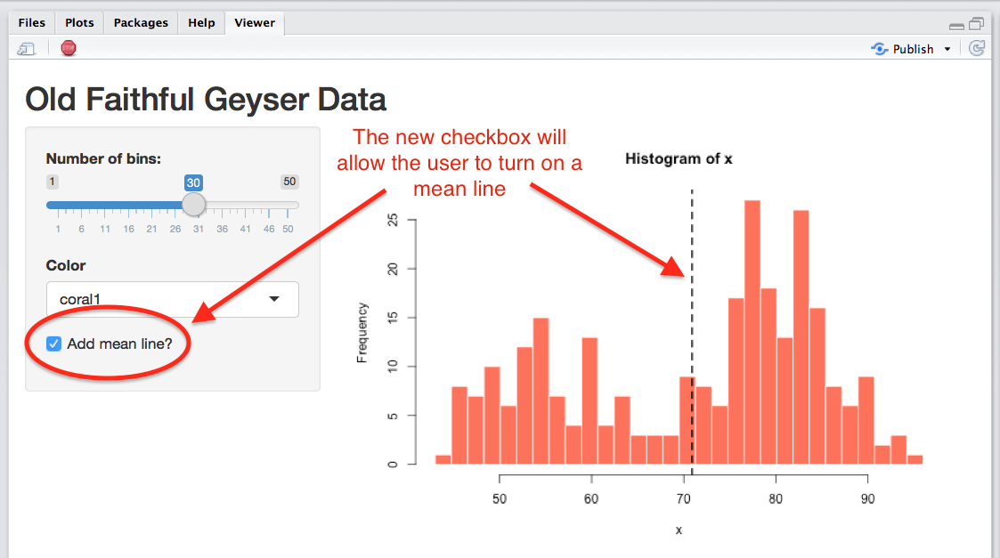
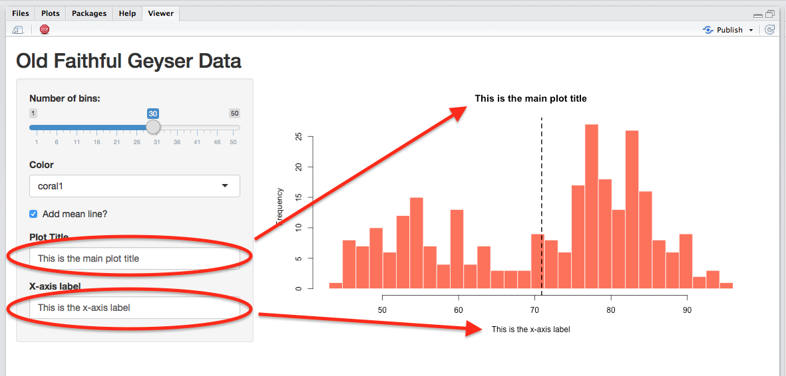
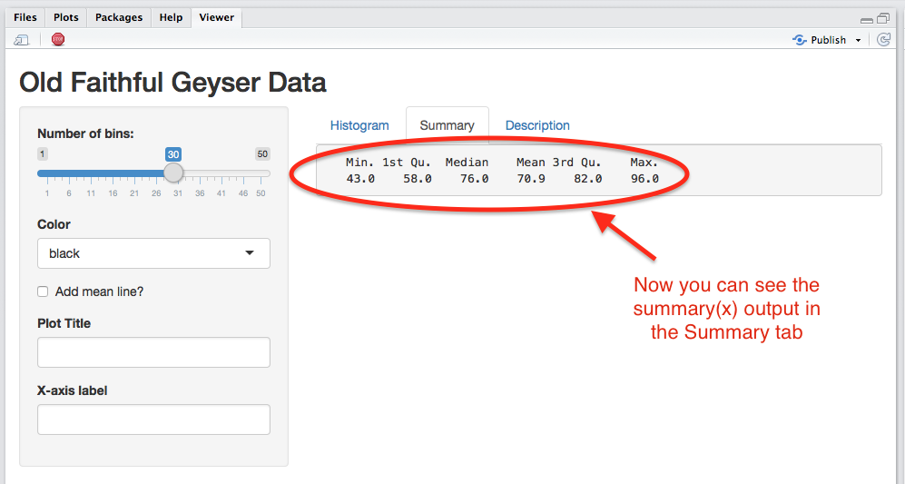
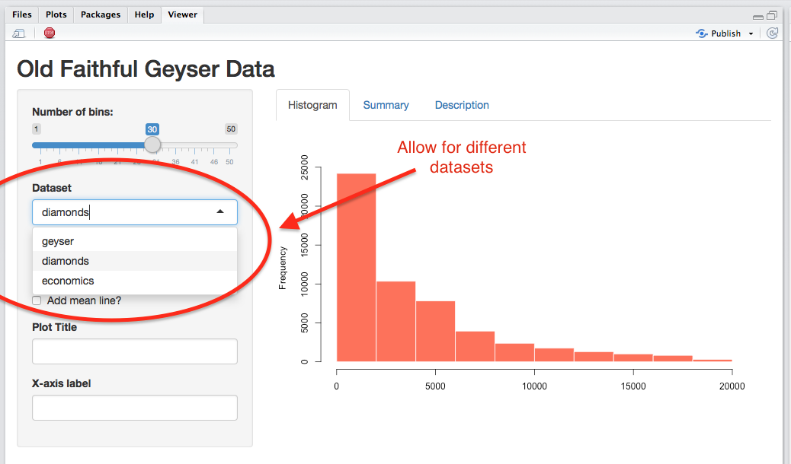

```{r, echo = FALSE}
knitr::opts_chunk$set(comment=NA, fig.width=6, fig.height=6, echo = FALSE, eval = FALSE, message = FALSE, warning = FALSE, fig.align = 'center', out.width = "100%")
```

```{r, echo = FALSE, fig.align = 'center', eval = TRUE, fig.cap= "Source: https://www.rstudio.com/", out.width = "30%"}
knitr::include_graphics("https://d21ii91i3y6o6h.cloudfront.net/gallery_images/from_proof/9306/small/1447177198/rstudio-hex-shiny-dot-psd.png")
```

### Slides

[Here are the introduction slides for this practical on Plotting 2.0: Shiny!](https://therbootcamp.github.io/_sessions/D3S3_PlottingII/PlottingII.html)


### Overview

In this practical you'll practice creating interactive graphics with `shiny`.

###Cheatsheet

```{r, echo = FALSE, fig.align = 'center', eval = TRUE, fig.cap= "http://shiny.rstudio.com/images/shiny-cheatsheet.pdf", out.width = "60%"}

```

If you don't have it already, you can access the `shiny` cheatsheet here [http://shiny.rstudio.com/images/shiny-cheatsheet.pdf](http://shiny.rstudio.com/images/shiny-cheatsheet.pdf)

### Examples

- Because Shiny code looks quite a bit different from standard R code, the best way to look at examples is to see a new app in action. In RStudio, click File -- New File -- Shiny Web App

```{r, echo = FALSE, fig.align = 'center', eval = TRUE, out.width = "60%"}
knitr::include_graphics("../_image/newapp_a_ss.png")
```

- Save the app under the name "geyser" in a directory of your choosing

```{r, echo = FALSE, fig.align = 'center', eval = TRUE, out.width = "60%"}
knitr::include_graphics("../_image/newapp_b_ss.png")
```

- A new file called `geyser.app` should now be open. Click the "Run App" button to open the app.

```{r, echo = FALSE, fig.align = 'center', eval = TRUE, out.width = "60%"}
knitr::include_graphics("../_image/newapp_d_ss.png")
```

- Your app should now be up in a new window! Play around with the Number of Bins slider to see its effect on the plot

```{r, echo = FALSE, fig.align = 'center', eval = TRUE, out.width = "60%"}
knitr::include_graphics("../_image/newapp_e_ss.png")
```


### Part A: Get started

By the end of this practical, you'll try to create the following app:

<iframe src="https://econpsychbasel.shinyapps.io/histogram_app/" width="800" height="600"></iframe>

1. Start by following the example above so you have your own `geyser.app`

2. Explore the code in the app to see how it works. Where in the app is the user interface defined? Where is the server code? Where does the server code get access to the vector of geyser data? In what object is the geyser data stored?

3. Change the main title of the app from "Old Faithful Geyser Data" to "___'s first Shiny App!" using your first name.

4. In the server code, change the color of the bins of the histogram to `"red"`. Reload your app to see your changes!

#### Part B: Add a `selectInput` to change bin colors

```{r, echo = FALSE, eval = TRUE}
knitr::include_graphics("../_image/shinygeyser_ss_B2.png")
```

5. Now let's add a new widget that allows the user to control the color of the histogram as a Select Box. Below the bin slider input, add a new `selectInput` like in the code below. 

```{r, eval = FALSE, echo = TRUE}
# Add a new selectInput to your app below the sliderInput():

 sliderInput("bins",
             "Number of bins:",
             min = 1,
             max = 50,
             value = 30),   # <- Dont forget to put a comma here

 # HERE!!! Add Bin Color Select Input
 selectInput(inputId = "bincolor",
             label = "Color",
             choices = c("red", "blue", "green", "black"),
             selected = "black")
```

6. Now reload your app. You should now see a new select box on the sidebar panel. Try playing around with it by changing the color to green. Nothing happens!??! Why is that???

```{r, echo = FALSE, eval = TRUE}

```

7. The problem is that we changed the input, but we haven't told the actual plotting code in the server portion of the app (specifically `hist()`) to use the new color input! In the server portion of the app, tell the histogram to use the new color input as follows:

```{r, eval = FALSE, echo = TRUE}
# Make this change to the hist() function in your app
#   This will tell Shiny that the colors of the histogram
#   bins should change based on the user's input

hist(x,
     breaks = bins,
     col = input$bincolor,   # HERE!!! Change color based on input$bincolor
     border = 'white')
```

8. Now reload the app and try changing the histogram bin color using the select input. You should now see a change in the color!

```{r, echo = FALSE, eval = TRUE}
knitr::include_graphics("../_image/shinygeyser_ss_B.png")
```


9. Right now we've told our color select input to have 4 possible colors by writing `choices = c("red", "blue", "green", and "black")`. But R has so many more colors, what if we wanted the select input to show all of the named colors in R like `"gold"`, `"skyblue"`, and more obscure colors like `"peachpuff4"`, `"olivedrab"` and `"lavender"`? It would be quite a pain to have to type all possible color names. Thankfully, we can easily pass a vector of color names to the `choices` input. The function `colors()` will return a vector of all 657 color names. In your console, try running `colors()` to see all of the colors.

```{r, echo = TRUE, eval = FALSE}
# Print a vector of all color names
colors()
```

10. Now, all we need to do to allow the select input in our app to allow all of these colors is to include the argument `choices = colors()` as follows:

```{r, eval = FALSE, echo = TRUE}
# This code will tell Shiny to include ALL 657 colors
#  in R as possible choices for the user in the bincolor input

 selectInput(inputId = "bincolor",
             label = "Color",
             choices = colors(), # <- HERE!!! change the choices to colors()
             selected = "black")
```

11. Now re-run your app! Your color input should now have access to *all* of the named colors in R. Try playing around with it to see the results!

```{r, echo = FALSE, eval = TRUE}

```


#### Part C: Add a `checkboxInput` to add mean line

```{r, echo = FALSE, eval = TRUE}

```


12. In this section, we'll add a new checkbox input that allows the user to add a line indicating the mean of the distribution. In the sidebar panel, add a new checkbox input called `"addmean"`

```{r, echo = TRUE, eval = FALSE}
# Add a new checkboxInput to your app

checkboxInput(inputId = "addmean",
                 label = "Add mean line?",
                 value = FALSE)
```

13. Now it's time to include the actual plotting code that will show the line. Below the `hist()` code that creates the histogram, include the following:

```{r, echo = TRUE, eval = FALSE}
# Add this code just below the histogram code to add 
#   a line at the mean IF the addmean checkbox is checked.

if(input$addmean) {  # If the addmean box is checked...

    # Add a vertical line at the mean of x
    abline(v = mean(x),
           lwd = 2,      # Thickness
           lty = 2)      # Dashed line
    
  } # close if statement
```

14. Reload the app and see your new checkbox in action!

#### Part D: Add plot labels with `textInput`

```{r, echo = FALSE, eval = TRUE}

```


15. Now we'll add the option for users to specify the title, and x-axis label of the plot. To do this, create two new text inputs using the `textInput()` function in the user interface.

```{r, echo = TRUE, eval = FALSE}
# Add 2 text inputs to the sidepanel with textinput()

textInput(inputId = "main",
          label = "Plot Title"),

textInput(inputId = "xlab",
          label = "X-axis label")
```

16. Then, include these inputs in the `hist()` function in the server code:

```{r, echo = TRUE}
hist(x,
     breaks = bins,
     col = input$bincolor,
     border = 'white',
     main = input$main,    # HERE!!! Change main title based on input$main
     xlab = input$xlab)    # HERE!!! Change x label  based on input$xlab

```

17. Reload the app and test your new text inputs!

#### Part E: Add a tab panel with `tabsetPanel`

18. One great way to create an app is to separate content, like different plots or tables of information, in different tabs. To create different tabs in your Shiny App, include the function `tabsetPanel()` within the `mainPanel()` function like this:

```{r, eval = FALSE, echo = TRUE}
# Create different tabs within your app by using tabsetPanel()
#  Here, we'll create three tabs, where the first tab 

mainPanel(
    tabsetPanel(type = "tabs",
                tabPanel("Histogram", plotOutput("distPlot")),  # The original Histogram
                tabPanel("Summary"),                            # Empty for now
                tabPanel("Description")                         # Empty for now
    )
    )
```

19. Reload your app, it should look like this. You should be able to click on the two new tabs, however, the Summary and Description tabs are currently empty. We'll fill them in the next step

```{r, echo = FALSE, eval = TRUE}
knitr::include_graphics("../_image/shinygeyser_ss_F.png")
```

20. Now let's fill in the Summary tab. When the user clicks on this tab, we'll print summary statistics of the data. We'll do this in two steps. First, we need to create the summary statistics, then *render* those statistics using `renderPrint()`, and then assign the result to `output$summary`. To do this, add the following code within your server function (you can actually put it anywhere in the server function!)

```{r, echo = TRUE}
# Add this code to the server function to return summary statistics

 output$summary <- renderPrint({
   x <- faithful[, 2]             # Define x again
   summary(x)
 })
```

21. Finally, we need to tell the `"Summary"` tab panel to display this information. To do this, add the function `verbatimTextOutput("summary")` to the `"Summary"` tab panel as follows:

```{r, echo = TRUE}
# Add verbatimTextOutput("summary") to the Summary tab panel

tabsetPanel(type = "tabs",
            tabPanel("Histogram", plotOutput("distPlot")),
            tabPanel("Summary", verbatimTextOutput("summary")),   # <- HERE!!!
            tabPanel("Description")
)
```

22. Reload the app! You should now see the summary output in the Summary tab!

```{r, echo = FALSE, eval = TRUE}

```

23. Finally, it's time to add a verbal description to our app in the Description tab. To do this, we can use a collection of the `h3(), p(), a()` functions. If you're familiar with HTML, these functions simply return HTML. Using the following code template, update the contents of the `"Description"` tab panel to display some text and a link.

```{r, echo = TRUE, eval = FALSE}
# Add HTML functions to the Description tab

tabsetPanel(type = "tabs",
            tabPanel("Histogram", plotOutput("distPlot")),
            tabPanel("Summary", verbatimTextOutput("summary")),
            tabPanel("Description",
                     h3("Shiny is Awesome!"),
                     p("You can really do anything with Shiny!"),
                     a("Click me to go to the Shiny page",
                       href = "https://shiny.rstudio.com/gallery/")
            )
)
```

24. Reload your app and click on the Description tab, you should now see your text!


```{r, echo = FALSE, eval = TRUE}
knitr::include_graphics("../_image/shinygeyser_ss_H.png")
```


#### Part F: Access different datasets with `reactive()`


```{r, echo = FALSE, eval = TRUE}

```


25. Next, we'll allow the user to plot data from 3 different datasets. To do this, first create a new select input box in the user interface as follows:

```{r, echo = TRUE, eval = FALSE}
# Add a new select input called mydata

selectInput(inputId = "mydata",
             label = "Dataset",
             choices = c("geyser", "diamonds", "economics"),
             selected = "geyser")
```

26. Now, in your server section, we need to define `x` as a *reactive value* that depends on the user's input to `input$mydata`. To do this, we'll remove the existing code that defines the object `x` and replace it with `x_reactive()` using the `reactive()` function. The `reactive()` function tells Shiny that `x_reactive` is isn't a stable value, but will change depending on user input. 

   - Step 1: Delete all existing code that defines the object `x` (right now you'll find it in both the `hist()` function and when we defined `output$summary`
   - Step 2: Using the following code, define `x_reactive` as a reactive value that can change depending on the `input$mydata`. If you haven't seen it before, the `switch()` function is a very helpful function that works like a series of if-then statements.

```{r, echo = TRUE, eval = FALSE}
# x is a reactive value that depends on input$mydata
#   This code should replace the previous code that defined x

# Put this code just after the server() function and BEFORE output$distPlot

x_reactive <- reactive({

  switch(input$mydata,  # Look at the value of input$mydata...
         "geyser" = faithful[,2],          # If the value is 'geyser', return data from faithful
         "economics" = economics$unemploy, # if the value is 'economics' return unemployment data
         "diamonds" = diamonds$price)      # If the value is 'diamonds' return price data

})
```

27. Now we need to make one last change. In **all** of the code that refers to `x` we need to replace `x` with `x_reactive()` (Don't forget the parentheses!!). Make this replacement for `hist()`, `summary()`, and `abline()`. Here is how you can do it:

```{r, echo = TRUE, eval = FALSE}
# Change the value x to x_reactive() in seq(), hist(), abline() and summary()

bins <- seq(min(x_reactive()),   # HERE!!! Change to x_reactive()
            max(x_reactive()),   # HERE!!! Change to x_reactive()
            length.out = input$bins + 1)

# [Skip some code...]

 hist(x_reactive(),              # HERE!!! Change to x_reactive()
      breaks = 10,
      col = input$bincolor,  
      border = 'white',
      main = input$main,
      xlab = input$xlab)

# [Skip some code...]

 abline(v = mean(x_reactive()),   # HERE!!! Change to x_reactive()
        lwd = 2, 
        lty = 2)
 
# [Skip some code...]
 
output$summary <- renderPrint({
   summary(x_reactive())         # HERE!!! Change to x_reactive()
 })
 
```


28. Reload your app and have fun!! You're finished!

## Challenges


C1. Now that you have multiple datasets, try removing the Plot title and X-axis label inputs (`input$main`, `input$xlab`), and instead have the plot automatically adjust the plot title and axis label based on the dataset the users selects. Just like we did with `x_reactive()`, you'll need to assign the main title and x label as reactive values.
  
C2. Add a new panel called "Table" where the user can view their selected dataset. To do this, in the server code, you'll need to create a new output called `output$tbl` which is is a rendered version of the data. Then in the UI, you'll need to include

```{r, eval = FALSE, echo = TRUE}
#### SERVER

# Send a rendered data table to output
#  DATASET should the the data as a dataframe

output$tbl <- renderUI({
    
  output$mytbl <- DT::renderDataTable(expr = DATASET, 
                                      options = list(lengthChange = FALSE))
    
    DT::dataTableOutput('mytbl')
    
})

#### UI

# Add the new Table tabpanel
tabsetPanel(type = "tabs",
            tabPanel("Histogram", plotOutput("distPlot")),
            tabPanel("Summary", verbatimTextOutput("summary")),  
            tabPanel("Description"),
            tabPanel("Table", uiOutput('tbl')))  # <- HERE!!!
```


C3. Try adding a new panel called `Test` where people can conduct a one-sample t-test on their data and view the results. To do this, you'll need to create a new output in the server called `output$printttest` which is a call to `renderPrint()`. Inside of `renderPrint()` you'll create the code for your test, and print the result. Next, in the UI, you'll need to add a new tab panel, and show the results by running `verbatimTextOutput('printttest')`. Look at the template below for help. If you'd like, you could also add a new user input that allows the user to customise the main arguments for the t.test, like `mu` and `alternative`.

```{r, eval = FALSE, echo = TRUE}
#### SERVER

# Send results of t-test to output
#  DATASET should the the data as a dataframe

# Print Test output

output$printttest <- renderPrint({
    
  mytest <- t.test(x = DATA, mu = 0, alternative = "two.sided")
  
    print(mytest)
    
  })
  

#### UI

# Add the new Table tabpanel
tabsetPanel(type = "tabs",
            tabPanel("Histogram", plotOutput("distPlot")),
            tabPanel("Summary", verbatimTextOutput("summary")),  
            tabPanel("Description"),
            tabPanel("Test", verbatimTextOutput('printttest')))  # <- HERE!!!
```

C4. So far we've used base plotting functions (e.g.; `hist()`, `abline()`). Try replacing these functions with ggplot code. For example, you could use `ggplot(data, aes(x)) + geom_hist()` to create a histogram. Note that because of the way you build on plots in ggplot, some parts of the code, such as the `addmean` functionality will be a bit tricky, so you may wish to remove it.

C5. In the [RStudio Shiny Gallery](https://shiny.rstudio.com/gallery/) at [https://shiny.rstudio.com/gallery/](https://shiny.rstudio.com/gallery/), you'll see a really cool Shiny App called Google Charts Demo. Click on the app, and then look at the underlying code. Try replicating this app yourself by creating a new app, and copying and pasting the Google Charts demo code into your app. Make sure the app runs. Then, try customising it! For example, you could change the default colors, or include the option for an additional filter in addition to the main "year" filter. Alternatively, you could try applying the chart to a dataset we've used in the bootcamp (like `mpg` or `diamonds`)

