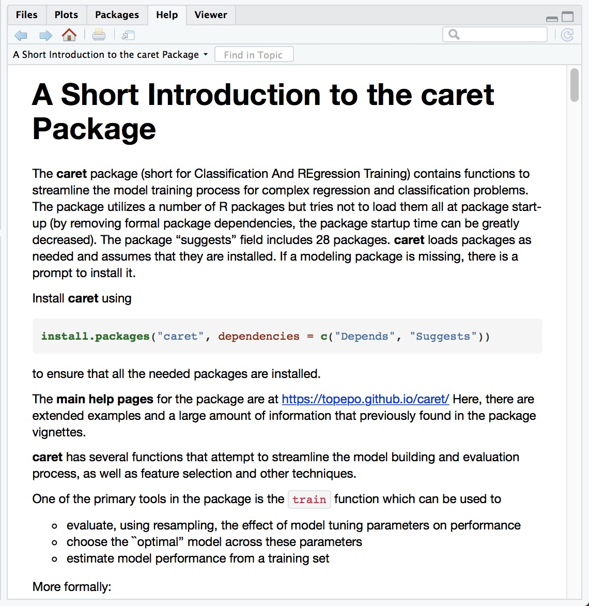
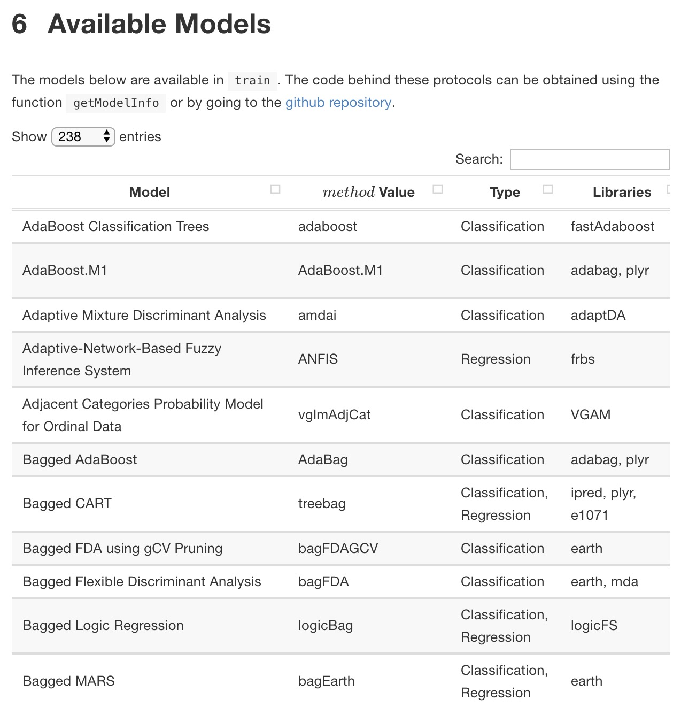
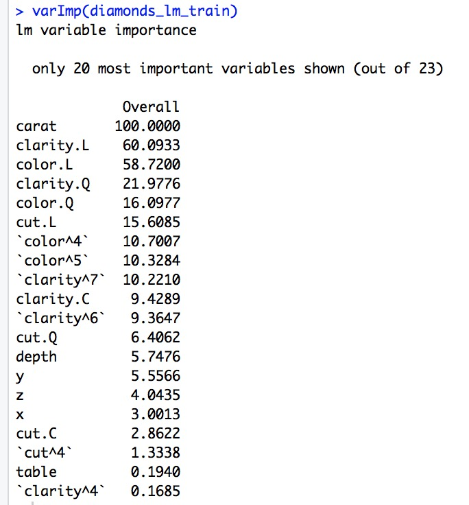
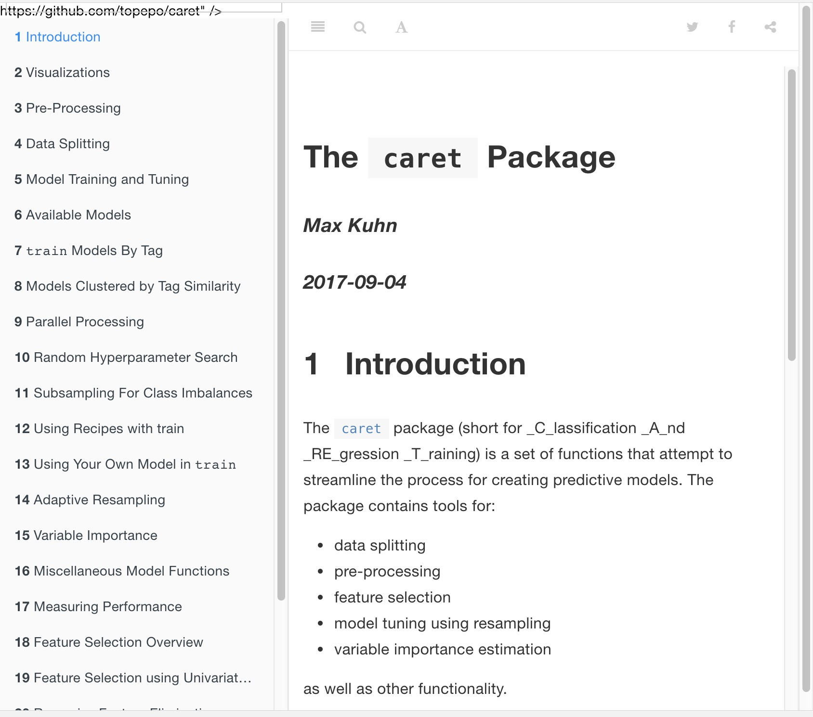

```{r setup, include=FALSE}
options(htmltools.dir.version = FALSE)
# see: https://github.com/yihui/xaringan
# install.packages("xaringan")
# see: 
# https://github.com/yihui/xaringan/wiki
# https://github.com/gnab/remark/wiki/Markdown
options(width=110)
options(digits = 4)
library(tidyverse)
```


# What is machine learning?

.pull-left6[


### Algorithms autonomously learning from data.

Given data, an algorithm tunes its *parameters* to match the data, understand how it works, and make predictions for what will occur in the future.

```{r, echo = FALSE, out.width = "80%", fig.align = 'center'}
knitr::include_graphics("https://raw.githubusercontent.com/therbootcamp/therbootcamp.github.io/master/_sessions/_image/mldiagram_A.png")
```

]

.pull-right4[

```{r, echo = FALSE, out.width = "70%", fig.align = 'center'}
knitr::include_graphics("https://raw.githubusercontent.com/therbootcamp/therbootcamp.github.io/master/_sessions/_image/machinelearningcartoon.png")
```


]

---
# What is the basic machine learning process?

```{r, echo = FALSE, out.width = "95%"}
knitr::include_graphics("https://raw.githubusercontent.com/therbootcamp/therbootcamp.github.io/master/_sessions/_image/MLdiagram.png")
```


---
## Two types of prediction tasks

.pull-left45[

```{r, echo = FALSE, out.width = "100%", fig.align = 'center'}
knitr::include_graphics("https://raw.githubusercontent.com/therbootcamp/therbootcamp.github.io/master/_sessions/_image/classification_task.png")
```


]


.pull-right45[

```{r, echo = FALSE, out.width = "100%", fig.align = 'center'}
knitr::include_graphics("https://raw.githubusercontent.com/therbootcamp/therbootcamp.github.io/master/_sessions/_image/regression_task.png")
```


]


---
# Training models

.pull-left55[


- Almost all machine learning models have *parameters* that need to be *fit* to the data.

    - Regression has *beta weights*, decision trees have *nodes and splits*

- The process of fitting parameters is called *training* a model

- One of the most common ways to train a model and find good parameters is with *10-Fold Cross Validation*

]


.pull-right4[

```{r, echo = FALSE, out.width = "60%", fig.align = 'center'}
knitr::include_graphics("https://upload.wikimedia.org/wikipedia/commons/thumb/3/3a/Linear_regression.svg/1200px-Linear_regression.svg.png")

knitr::include_graphics("http://www.milbo.org/rpart-plot/rpart.plot-example1.png")
```


]

---
# 10 Fold Cross Validation

```{r, echo = FALSE, out.width = "85%", fig.align = 'center', fig.cap="Source: Wikipedia"}
knitr::include_graphics("https://upload.wikimedia.org/wikipedia/commons/1/1c/K-fold_cross_validation_EN.jpg")
```

---
# 10 Fold Cross Validation

.pull-left5[


### Why use 10 fold cross validation?

- Allows you to simultaneously *estimate* model *prediction* performance from training data

- Can show parameter *stability* across different subsets of data.

- If you *repeat* the process, you can try different parameter value and see which ones predict data best


]

.pull-right45[

```{r, echo = FALSE, out.width = "100%", fig.align = 'center', fig.cap="Source: Wikipedia"}
knitr::include_graphics("https://upload.wikimedia.org/wikipedia/commons/1/1c/K-fold_cross_validation_EN.jpg")
```

]


---
# 10 Fold Cross Validation

.pull-left5[

### How do you conduct 10 fold cross validation?

- You could program your own 10 fold cross validation code by hand. But it would be very long (and probably have many errors!).

- You would have to cusomise the code to apply to many different types of models (regression, random forests, decision trees, etc...)

- It would be a nightmare...


### Thankfully, there is a solution...


```{r, echo = FALSE, fig.align = 'center'}
knitr::include_graphics("https://vignette.wikia.nocookie.net/joke-battles/images/2/21/Bugs-Bunny-4.png/revision/latest?cb=20151231234917")
```


]

.pull-right45[

```{r, echo = FALSE, out.width = "100%", fig.align = 'center', fig.cap="Source: Wikipedia"}
knitr::include_graphics("https://upload.wikimedia.org/wikipedia/commons/1/1c/K-fold_cross_validation_EN.jpg")
```

]

---

.pull-left55[

# Caret


```{r, echo = FALSE, fig.align = 'center', out.width = "35%"}
knitr::include_graphics("https://vignette.wikia.nocookie.net/joke-battles/images/2/21/Bugs-Bunny-4.png/revision/latest?cb=20151231234917")
```

- Caret stands for Classification And REgression Training.

- Caret is data scientist's dream for conducting machine learning.

- No need to learn different functions or syntax for different models.

    - `method = 'lm'` ...Regression!
    - `method = 'rm'` ...Random forests!

- Do very complex machine learning tasks with a few simple functions


]

.pull-right45[
<br><br><br>
```{r, echo = FALSE, fig.align = 'center', out.width = "90%", fig.cap = "The almighty Caret!"}
knitr::include_graphics("https://3qeqpr26caki16dnhd19sv6by6v-wpengine.netdna-ssl.com/wp-content/uploads/2014/09/Caret-package-in-R.png")
```

```{r, echo = FALSE, out.width = "100%", fig.align = 'center'}
knitr::include_graphics("https://upload.wikimedia.org/wikipedia/commons/1/1c/K-fold_cross_validation_EN.jpg")
```


]


---
.pull-left5[

# Caret


As always, you can install `caret` from CRAN

```{r, eval = FALSE, echo = TRUE}

# Install caret
install.packages("caret")

# Load the caret package
library("caret")
```

Once you've installed `caret`, look at the vignette for a nice overview of the package

```{r, eval = FALSE}
# Open the main package vignette
vignette("caret")
```


Today we will go over the main functions in the package


]

.pull-right45[

### Caret Vignette

```{r, echo = FALSE, out.width = "90%"}

```


]


---

.pull-left5[
# Caret


Here are the main functions in the `caret` package

| Function| Purpose|
|--------|----------|
| `trainControl()` | Determine how training (in general) will be done|
| `train()` | Specify a model and find *best* parameters |
| `varImp()` | Determine variable importance |

]


.pull-right45[

### Caret Vignette

```{r, echo = FALSE, out.width = "90%"}

```

]


---

# Caret

### trainControl()

- Use `trainControl()` to define a general fitting process.


```{r, echo = TRUE, out.width = "90%", eval = FALSE}

# Get ready for 10 fold cross validation!

mycontrol <- trainControl(method = "repeatedcv", # Do repeated cross validation
                          number = 10,           # 10 folds
                          repeats = 50)         # Repeat 50 times (!)
```


- Can specify cross validation with `method = "repeatedcv"`
    - Many other methods are available too!
    
- Can *repeat* cross validation many times with `repeats`


---

.pull-left6[

# Caret

### train()

- Use `train()` to fit **any** of over 200 models **and** get best parameters

```{r, echo = TRUE, out.width = "90%", eval = FALSE}

train(form = price ~ .,      # Criterion
      data = data_train,     # Training data
      method = "lm",         # Specify a model
      trControl = mycontrol) # Use mycontrol parameters
```

- Specify the criterion to be predicted as a formula with `form`

- Specify training data with `data`

- Choose a model with `method`
    - `method = 'lm'` = Linear regression
    - `method = 'rf` = Random forest

]

.pull-right35[

See all >280 models at [http://topepo.github.io/caret/available-models.html](http://topepo.github.io/caret/available-models.html)

```{r, echo = FALSE}

```


]

---

.pull-left5[

# Caret

### varImp()

- Use `varImp()` to extract **variable importance** from a model

```{r, echo = TRUE, out.width = "90%", eval = FALSE}

# Look at variable importance with varImp
varImp(diamonds_lm_train)
```

- Result will be a vector showing how important each variable was in predicting the criterion.

- Specific outputs depend on the model
    - Regression: Regression weights
    - Decision trees: Mean *gini* index.
    
]


.pull-right45[

```{r, echo = FALSE}

```


]


---


<br><br>
.pull-left5[

# Caret


- There are *many* other great features of caret we haven't touched
   - Splitting data with `createDataPartition()`
   - Imputing (replacing) missing values and transforming predictors with `preProcess()`
   - Add your own custom model
   

- Be sure to check out the **excellent** documentation site to learn all the details


]

.pull-right45[

### http://topepo.github.io/caret/index.html


```{r, echo = FALSE}

```

]

---

## Machine Learning II Live Demo & Practical

<p><font size=6><b><a href="https://therbootcamp.github.io/BaselRBootcamp_2018April/_sessions/D3S1_MachineLearningII/MachineLearningII_practical.html">Link to Machine Learning II practical</a>


