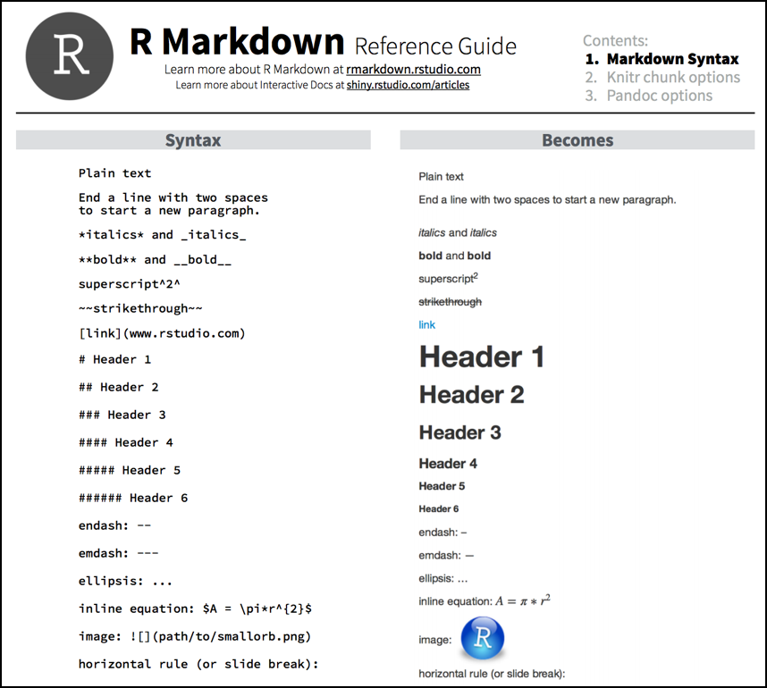
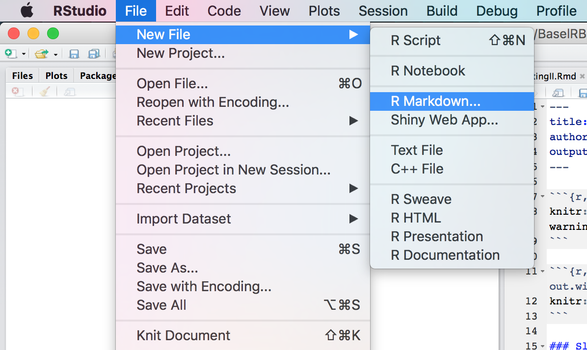
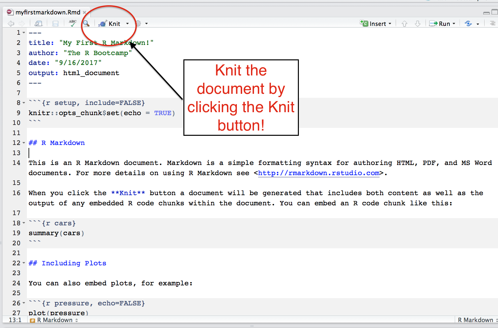
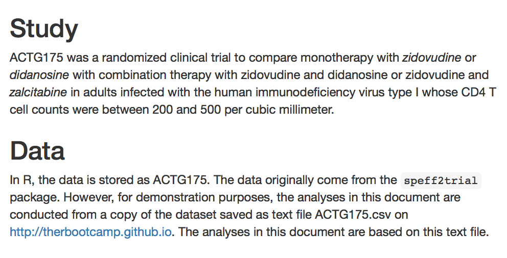
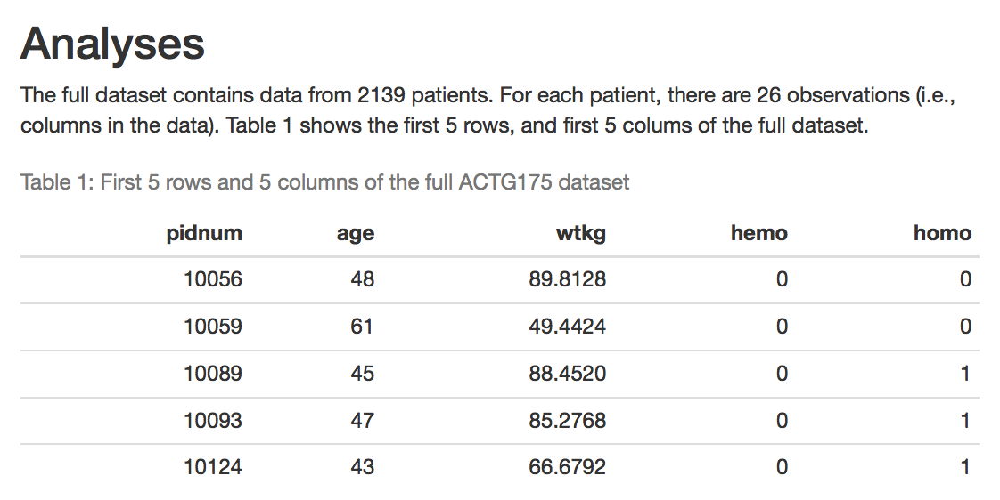
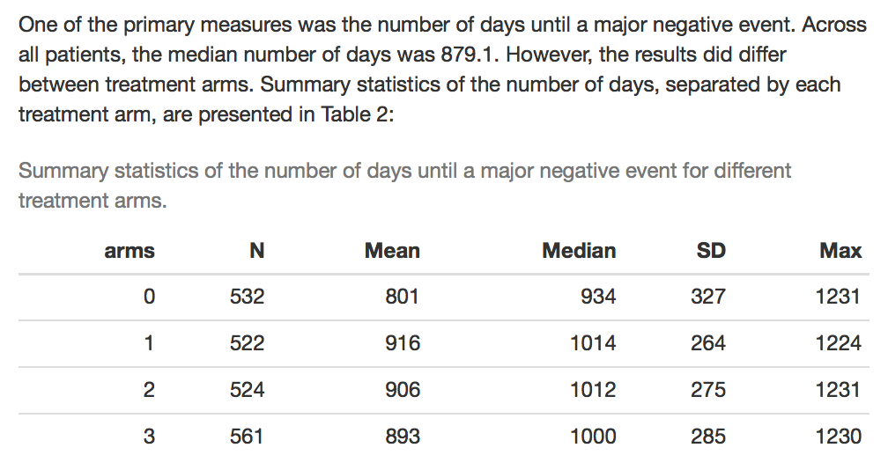
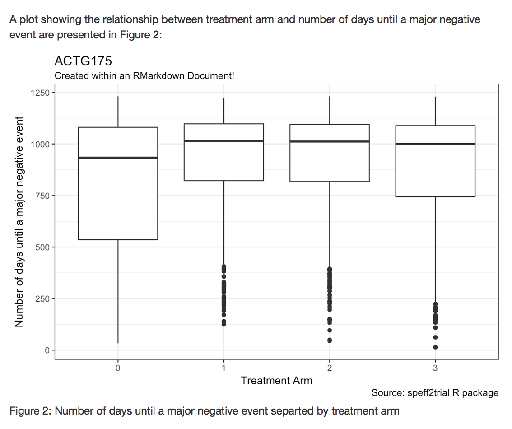

```{r, echo = FALSE}
knitr::opts_chunk$set(comment=NA, fig.width=6, fig.height=6, echo = FALSE, eval = FALSE, message = FALSE, warning = FALSE, fig.align = 'center', out.width = "100%")
```

```{r, echo = FALSE, fig.align = 'center', eval = TRUE, fig.cap= "Source: https://www.rstudio.com/", out.width = "30%"}
knitr::include_graphics("../_image/rmarkdown_hex.png")
```

### Slides

[Here are the introduction slides for this practical on dynamic reports!](https://therbootcamp.github.io/_sessions/D4S1_DynamicReports/DynamicReports.html)

### Overview

In this practical you'll practice creating interactive reports using RMarkdown.

### Cheatsheet

```{r, echo = FALSE, fig.align = 'center', eval = TRUE, fig.cap= "https://www.rstudio.com/wp-content/uploads/2015/03/rmarkdown-reference.pdf", out.width = "60%"}

```

If you don't have it already, you can access the `Markdown` cheatsheet here [https://www.rstudio.com/wp-content/uploads/2015/03/rmarkdown-reference.pdf](https://www.rstudio.com/wp-content/uploads/2015/03/rmarkdown-reference.pdf)

### Examples

- Because R Markdown looks quite a bit different from standard R code, the best way to look at examples is to see a new R Markdown document in action. In RStudio, click File -- New File -- R Markdown

```{r, echo = FALSE, fig.align = 'center', eval = TRUE, out.width = "60%"}

```

- Give the document a title and an author. For the output format, select HTML (the default). Click Ok!

```{r, echo = FALSE, fig.align = 'center', eval = TRUE, out.width = "60%"}
knitr::include_graphics("../_image/rmarkdown_ss_B.png")
```

- A new file that looks like this should open up. This is your first R Markdown document!

```{r, echo = FALSE, fig.align = 'center', eval = TRUE, out.width = "60%"}
knitr::include_graphics("../_image/rmarkdown_ss_C.png")
```

- Before you do anything else, let's *knit* the R Markdown document to an HTML file. Click the *knit* button (or use the Command + Shift + K shortcut)

```{r, echo = FALSE, fig.align = 'center', eval = TRUE, out.width = "60%"}

```

- Now you should see your final, HTML document! Scroll up and down the document and see how she looks!

```{r, echo = FALSE, fig.align = 'center', eval = TRUE, out.width = "60%"}
knitr::include_graphics("../_image/rmarkdown_ss_E.png")
```


### Tasks

1. Create a new R project called `dynamicreports.Rproj`. Add four folders `data`, `code`, `materials`, `markdown`.

2. Go through the Examples above to create a new R Markdown document. Save the document under the name `speffanalysis.Rmd` in the `markdown` folder.

3. At the top of the `speffanalysis.Rmd` document, add a new R chunk. You can do this by clicking the "Insert" button at the top of the console, or by using the "Option + Command + i" shortcut on Mac. 

4. In the chunk options, include `echo = FALSE, message = FALSE, warning = FALSE`. 

5. Inside of the chunk include the following code in the following chunk: The `knitr::opts_knit$set(dir = "../")` code will move your working directory one folder up to the project root, while `knitr::opts_chunk$set()` will set your global chunk options. Finally, `options(digits = 2)` makes sure that all of your numeric output is rounded to two decimal places.

```{r, eval = FALSE, echo = TRUE}
# Move working directory one folder up
knitr::opts_knit$set(root.dir = "../")

knitr::opts_chunk$set(fig.width = 6,        # Figure width (in)
                      fig.height = 6,       # Figure height (in)
                      echo = TRUE,          # Repeat code
                      eval = TRUE,          # Evaluate chunks
                      message = FALSE,      # Don't print messages
                      warning = FALSE,      # Don't print warnings
                      fig.align = 'center') # Center figures

options(digits = 2)  # Round all output to 2 digits
```

6. Now let's load some packages. Inside your chunk, write the comment `# Loading Packages -------------`. Then, using the `library()` function, load the packages `tidyverse`, `knitr` and `speff2trial`. 

7. Knit the document to make sure it worked! If you have any errors, try to figure out how to solve them!

8. For this practical we'll use the `ACTG175` dataset. This dataset originally comes from the `speff2trial` package. However, I saved a copy of the dataset as a comma--separated text file at `"https://raw.githubusercontent.com/therbootcamp/therbootcamp.github.io/master/_sessions/_data/ACTG175.csv"`. Open this link in a web-browser, and then save the `ACTG175.csv` file to the `data` folder of your project.

9. Create a new code chunk and put it under the previous one. We will use this chunk to load the `ACTG175.csv`. In this chunk, load csv file with `read_csv()` and assign the result to the object `ACTG175`.

10. Knit the document! Diagnose and correct any errors!

11. Add the necessary text and markdown to your document to create the following two paragraphs. Pay attention to the header sizes, *italics* and `code` formats.

```{r, fig.cap = "Write the necessary markdown to create this output!", eval = TRUE, echo = FALSE, out.width = "75%"}

```

12. Knit the document! Diagnose and correct any errors!

13. Add the appropriate combination of text, markdown, code chunks, and R code to add the following output to your document. To report the number of patients, use an in-line chunk to access the number directly from the data using the `nrow()` function, -- that is, don't type 2139 directly! To create the table, create a new chunk, and inside that chunk, use the `kable()` function, with the appropriate arguments, to create the table.

```{r, echo = FALSE, out.width = "75%", eval = TRUE}

```

14. Knit the document! Diagnose and correct any errors!

15. Write the necessary code to add the following output to your document. To do this, create a new chunk. In the chunk use `dplyr` code to create the summary table of data. Assign the result to the object `trial_summary`. Then, use `kable()` to render this dataframe as a table in the final document.

```{r, echo = FALSE, out.width = "75%", eval = TRUE}

```

Here is some code you might find helpful in creating this table!

```{r, echo = TRUE}
# Helpful code to create the summary table!

trial_summary <- ACTG175 %>% 
                 group_by(XX) %>% 
                 summarise(
                          N = n(),
                          Mean = mean(XX),
                          Median = median(XX),
                          SD = sd(XX),
                          Max = max(XX))
```

16. Knit the document! Diagnose and correct any errors!

17. Add the appropriate combination of text, markdown, code chunks, and R code to add the following output to your document. Be sure to include the figure caption (you can do this with the `fig.cap` argument to the chunk)

```{r, echo = FALSE, out.width = "75%", eval = TRUE}

```

This code might help you to create the plot:

```{r, eval = FALSE, echo = TRUE}
# Boxplot code template

ggplot(data = XX, 
       mapping = aes(x = factor(XX), y = XX)) +
  geom_boxplot() + 
  labs(x = "XX",
       y = "XX",
       title = "XX",
       subtitle = "XX",
       caption = "XX") + 
  theme_bw()
```

18. Knit the document! Diagnose and correct any errors!

19. A researcher wants to know if there is a correlation between patients' CD4 T cell count at baseline (`cd40`) and the number of days until a major negative event.  Include this information as a new subsection (with a second level header) in your analyses. To do this, run the following chunk. Then, write a sentence with the main outputs from the test, using inline chunks to directly access the correlation and the p-value. For example, a sentence could be: "The correlation between CD4 T cell count at baseline and number of days until a major negative event was r = XX, p = YY".

```{r, eval = FALSE, echo = TRUE}
# Correlation test between cd40 and days

cd4_cor <- cor.test(formula = ~ XX + XX,
                    data = XX)

cd4_cor_r <- cd4_cor$XX  # Get the correlation
cd4_cor_p <- cd4_cor$XX   # Get the p-value
```

20. In addition to the correlation test, include a relevant scatterplot showing the relationship between CD4 T cell count at baseline (`cd40`) and number of days until a major negative event (`days`).

21. Add a new section called "Conclusions". Write the main conclusions of your analyses in one or two sentences. Feel free to add some formatting and/or in-line chunks to your content!

22. (Optional) You can easily publish an HTML document online to Rpubs.com for free. To do this, Knit your document. Then, click the blue "Publish" button. Go through the process of signing up for a free Rpubs account and get your document online!

## Slideshow

```{r, eval = TRUE, echo = FALSE, out.width = "50%"}
knitr::include_graphics("https://raw.githubusercontent.com/therbootcamp/therbootcamp.github.io/master/_sessions/_image/xaringan_ss.png")
```

23. Now it's time to create a slideshow! To do this, we'll use the Ninja template ([click here for a demo](https://slides.yihui.name/xaringan/#1)) from the `xaringan` package (that's what we use for all of our BaselRBootcamp slides). To install the `xaringan` package from GitHub, run the following code. 
```{r, eval = FALSE, echo = TRUE}
# Install the xaringan package from github
devtools::install_github("yihui/xaringan")
```

Once you've installed `xaringan`, open a new template with File -- New File -- R Markdown -- From Template -- Ninja Presentation. Give the presentation a title and your name as the author. Then click ok.

24. You should see a new .Rmd document open. Save the document in your main directory as `slideshow.Rmd`.

25. Knit the document to see the outline of the presentation!

26. Play around with the presentation a bit. Change the existing content a bit and add a few slides. Try adding an image (maybe this one: https://actgnetwork.org/sites/all/themes/actg/images/actg_logo_275.png) by saving the image to your `materials` folder, and then loading the image into your document with `include_graphics()`.

27. Now, try to customize the presentation to include all of main analyses, outputs, and plots you have in your `speffanalysis.Rmd` document! Of course, there won't be room for all of the text, so treat it like a normal presentation and put in what's important.

### References and Links

- Want to see the .Rmd file that created this practical? You can find it [here](https://raw.githubusercontent.com/therbootcamp/therbootcamp.github.io/master/_sessions/D4S2_DynamicReports/DynamicReports_practical.Rmd).

- The `rmdformats` package has many nice templates for .Rmd files. Look at their GitHub page at [https://github.com/juba/rmdformats](https://github.com/juba/rmdformats) for examples. If you install the package from CRAN with `install.packages('rmdformats')`, you'll get lots of new templates when you open a new Markdown file in RStudio. 

- If you want to use custom .css files, check out the the [R Studio HTML document guide](http://rmarkdown.rstudio.com/html_document_format.html#custom_css). You can also look at the .css files underlying the `rmdformats` package on their GitHub page here [https://github.com/juba/rmdformats](https://github.com/juba/rmdformats). For example, here is their .css file for the "html docco" template [https://raw.githubusercontent.com/juba/rmdformats/master/inst/templates/html_docco/docco.css](https://raw.githubusercontent.com/juba/rmdformats/master/inst/templates/html_docco/docco.css)
